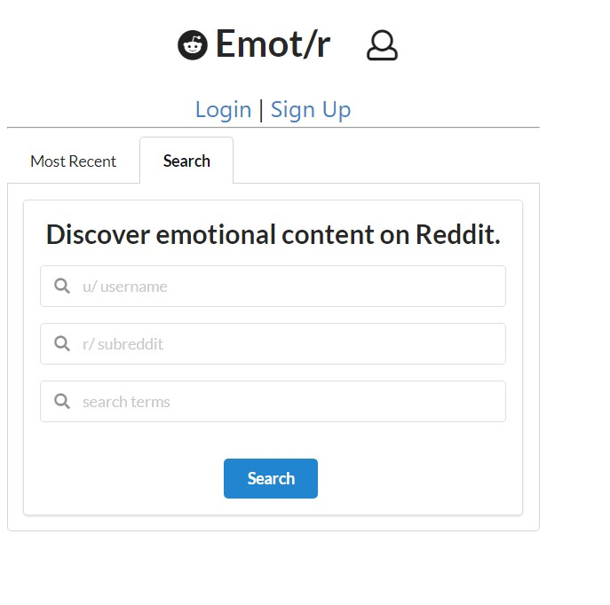

# Under Construction, 10/19/2021

<!-- PROJECT LOGO -->
 

    
  </a>

  <h3 align="center">Emot/r</h3>

  

    Analyze the sentiment and emotional content of Reddit content using machine learning!
     
    <a href="https://github.com/bfreed76"><strong>Explore more of my apps »</strong></a>
     
     
    <a href="https://github.com/othneildrew/Best-README-Template">View DemoXX</a>
    ·
    <a href="https://github.com/othneildrew/Best-README-Template/issues">Report BugXX</a>
    ·
    <a href="https://github.com/othneildrew/Best-README-Template/issues">Request FeatureXX</a>
  

<!-- TABLE OF CONTENTS -->

  
Table of Contents

  <ol>
    <li>
      <a href="#about-Emot/r">About Emot/r</a>
      <ul>
        <li><a href="#built-with">Built With</a></li>
      </ul>
    </li>
    <li>
      <a href="#getting-started">Getting Started</a>
      <ul>
        <li><a href="#prerequisites">Prerequisites</a></li>
        <li><a href="#installation">Installation</a></li>
      </ul>
    </li>
    <li><a href="#usage">Usage</a></li>
    <li><a href="#roadmap">Roadmap</a></li>
    <li><a href="#contributing">Contributing</a></li>
    <li><a href="#license">License</a></li>
    <li><a href="#contact">Contact</a></li>
    <li><a href="#acknowledgments">Acknowledgments</a></li>
  </ol>

<!-- ABOUT Emot/r -->
## About Emot/r

Emot/r uses IBM Watson's Natural Language Understanding to extract emotional content and overall sentiment from Reddit content. Users can search any combination of search terms, Reddit usernames, or subreddits to narrow their search of topics. 

Use Emot/r to:
* determine the emotional flavor of a Reddit user's posts or an entire subreddit
* explore general sentiment from Reddit users on a particular topic
* track emotional content around specific social issues or interests.

Due to IBM Watson's monthly usage limits, I have capped the search results at the last 50 comments. If you would like to see increased comment count or have feature requests such as, inclusion of Reddit submmissions or an option to search by date, please email me with your request. Write "Emot/r feature request" in the subject line.

(<a href="#top">back to top</a>)

### Built With

This section should list any major frameworks/libraries used to bootstrap your project. Leave any add-ons/plugins for the acknowledgements section. Here are a few examples.

* [React.js](https://reactjs.org/) 
* [React Router](https://reactrouter.com/) 
* [Semantic UI React](https://react.semantic-ui.com/) 
* [IBM Watson](https://www.ibm.com/watson) 