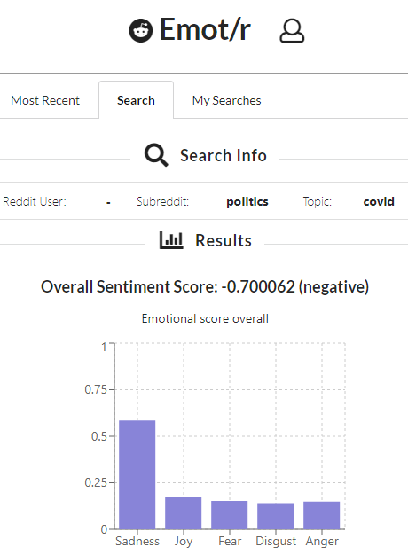
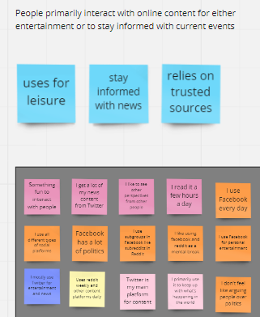
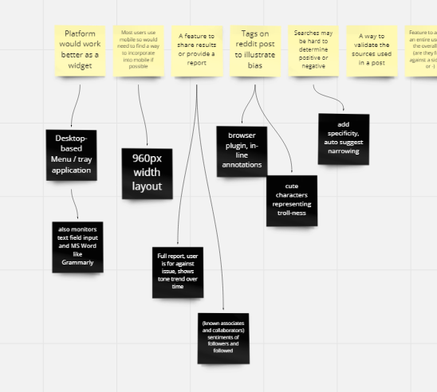
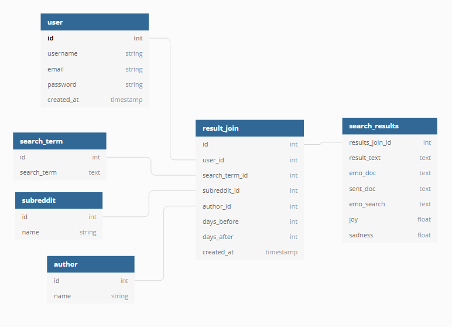
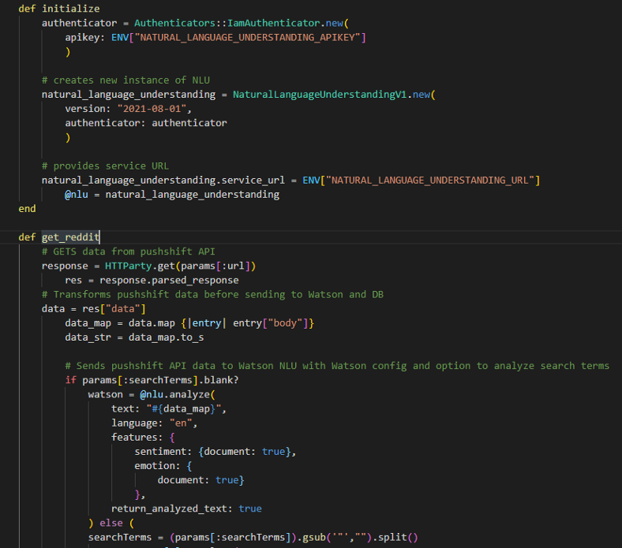

<div id="top"></div>

<!-- PROJECT LOGO -->
<br />

  <h1 align="center">Emot/r</h1>

  <p align="center">
    Analyze the sentiment and emotional content of Reddit content using machine learning!
    <br />
        <a href="https://dashboard.heroku.com/apps/reddit-emotion-analyzer">Use Emot/r on Heroku</a>
    <br />
    <br />
  </p>
  
</div>


<!-- TABLE OF CONTENTS -->
<details>
  <summary>Table of Contents</summary>
  <ol>
    <li>
      <a href="#about-Emot/r">About Emot/r</a>
      <ul>
        <li><a href="#built-with">Built Using</a></li>
      </ul>
    </li>
    <li>
      <a href="#getting-started">Getting Started</a>
      <ul>
        <li><a href="#prerequisites">Prerequisites</a></li>
        <li><a href="#installation">Installation</a></li>
      </ul>
    </li>
    <li><a href="#startup">Startup</a></li>
    <li><a href="#background">Background</a></li>
    <li><a href="#contributing">Contributing</a></li>
    <li><a href="#license">License</a></li>
    <li><a href="#contact-me">Contact Me</a></li>
    <li><a href="#acknowledgments">Acknowledgments</a></li>
  </ol>
</details>


<!-- ABOUT Emot/r -->
## About Emot/r


Emot/r uses IBM Watson's Natural Language Understanding to extract emotional content and overall sentiment from Reddit content. Users can use any combination of search terms, Reddit usernames, or subreddits to narrow their search. 

Use Emot/r to:
* determine the emotional content (sadness, joy, fear, anger, disgust) of a Reddit user's posts or an entire subreddit.
* explore general sentiment from all Reddit users on a particular topic.
* track emotional content around specific social issues or interests.

Due to IBM Watson's monthly usage limits, I have capped the search results at the last 50 comments posted to Reddit. If you would like to see increased max count or have feature requests, such as inclusion of Reddit submmissions or an option to search by date, please [email me](mailto:brintonfoyreed@gmail.com) with your request. Please write <strong>"Emot/r feature request"</strong> in the subject line.


### Built Using

[](https://reactjs.org/) [](https://reactrouter.com/) [](https://www.postgresql.org/) [](https://www.heroku.com/) [](https://https://ruby-lang.org/) [](https://rubyonrails.org/) [](https://www.ibm.com/watson) [](https://react.semantic-ui.com/) 

<p align="right">(<a href="#top">back to top</a>)</p>


<!-- GETTING STARTED -->
## Getting Started

To get Emot/r up and running, please follow these steps.

### Prerequisites

[](https://svgshare.com/i/Zhy.svg) [](https://svgshare.com/i/ZhY.svg)  *Not tested on MacOS


- Please ensure you are using Ruby version 2.7.4.
  ```sh
  ruby -v 
  ```

- [IBM Watson Natural Language Understanding (NLU) account](https://www.ibm.com/cloud/watson-natural-language-understanding): follow the link to set up your free account.
  -  Once you have a cloud account, you can create a Natural Langauge Understanding project by selecting 'create resource' from your dashboard. 
- [IBM Watson credentials](https://cloud.ibm.com/docs/watson?topic=watson-iam)
- Emot/r uses the following additional gems (loads automatically from Gemfile)
  - bcrypt: user authentication/password hashing
  - postgresql: required database for deployment to Heroku
  - email validator: validate user email addresses
  - httparty: enable connection to Web-based APIs from the backend
  - ibmwatson: enables use of IBM Watson from the backend
  - dotenv-rails: seperates IBM Watson credentials from sourcecode
  - rufo: ruby file formatter


### Installation

1. Clone the repo
   ```sh
   git clone https://github.com/bfreed76/Reddit-Sentiment-Analyzer.git
   ```
3. Install NPM packages
   ```sh
   npm install
   ```
4. Install dependencies
   ```sh
   bundle install
   ```
5. Create .env file in root directory
   ```sh
   touch .env
   ```
6. Add IBM Watson NLU credentials to .env file
   ```sh
   # ./env
   NATURAL_LANGUAGE_UNDERSTANDING_APIKEY=[ your IBM Watson API key ]
   NATURAL_LANGUAGE_UNDERSTANDING_IAM_APIKEY=[ your IBM Watson API key ]
   NATURAL_LANGUAGE_UNDERSTANDING_URL=[ your IBM Watson credentails URL ]
   NATURAL_LANGUAGE_UNDERSTANDING_AUTH_TYPE=iam
   ```
7. Ensure that your .gitignore file includes all .env files
   ```
   # ./gitignore
   *.env
   ```
   
### Startup
1. Start postgres server
   ```sh
   sudo service postgresql start
   ```
2. Create and seed the database
   ```sh
   rails db:create 
   rails db:seed
   ```
3. Install npm and start React server
   ```sh
   npm install --prefix client
   npm run --prefix client
   ```
4. Start rails server
   ```sh
   rails s
   ```

<p align="right">(<a href="#top">back to top</a>)</p>

<!-- USAGE EXAMPLES -->
## Background

The idea for this app came from a conversation with a friend about natural language understanding. As a previous military crytolinguist, I've always had an interest in language, and how it frames our worldview and actions. Given all of the talk in the last few years about fake news and social media news, we thought pairing sentiment analysis with reddit posts would provide telling information about subreddits, Reddit users and Reddit content, as a whole. 

<p align="center">

</p>

I collaborated with a Career Foundary UX grad and his mentor, a seasoned UX designer. They helped me refine my user cases and user stories, and provided wireframes.

<p align="center">

</p>

They also conducted a small (n=5) study with Reddit users and found that nearly all subjects would prefer to use the app on a mobile device. Thus, I developed the app according to responsive design principles. 

<p align="center">

</p>

I set up the postgres database with the following data structure. 

<p align="center">

</p>

Due to the potentially large datasets involved and the required use of credentials, I decided to access Reddit data (via [pushshift api](https://github.com/pushshift/api)) and apply IBM Watson NLU analysis from Rails, instead of from the frontend. 

<p align="center">

</p>

<p align="right">(<a href="#top">back to top</a>)</p>


<!-- CONTRIBUTING -->
## Contributing

Contributions are what make the open source community such an amazing place to learn, inspire, and create. Any contributions you make are **greatly appreciated**.

If you have a suggestion that would make this better, please fork the repo and create a pull request. You can also simply open an issue with the tag "enhancement."
Don't forget to give the project a star! Thanks again!

1. Fork the Project
2. Create your Feature Branch (`git checkout -b feature/AmazingFeature`)
3. Commit your Changes (`git commit -m 'Add some AmazingFeature'`)
4. Push to the Branch (`git push origin feature/AmazingFeature`)
5. Open a Pull Request

<p align="right">(<a href="#top">back to top</a>)</p>


<!-- LICENSE -->
## License

Distributed under the MIT License. 

<p align="right">(<a href="#top">back to top</a>)</p>


<!-- CONTACT -->
## Contact Me

[](https://www.linkedin.com/in/brintonfoyreed/) [](https://www.instagram.com/nigels_vacation/) [](https://brintonfoyreed.medium.com/)[ ](mailto:brintonfoyreed@gmail.com)

Project Link: [Emot/r](https://reddit-emotion-analyzer.herokuapp.com/)
<a href="https://github.com/bfreed76"><strong>See more apps on my profile page »</strong></a>

<p align="right">(<a href="#top">back to top</a>)</p>


<!-- ACKNOWLEDGMENTS -->
## Acknowledgments

Use this space to list resources you find helpful and would like to give credit to. I've included a few of my favorites to kick things off!

* [IBM Watson](https://www.ibm.com/watson)
* [Pushshift API](https://github.com/pushshift/api)
* [GitHub Emoji Cheat Sheet](https://www.webpagefx.com/tools/emoji-cheat-sheet)
* [Img Shields](https://shields.io)
* [Font Awesome](https://fontawesome.com)
* [React Icons](https://react-icons.github.io/react-icons/search)

<p align="right">(<a href="#top">back to top</a>)</p>